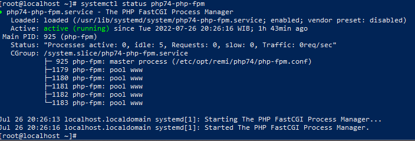

# LEPM CENTOS 7
<details>
<summary>### DISABLE SELINUX</summary>
Disable selinux dengan cara mengubah SELINUX=enforcing menjadi SELINUX=disabled
\
caranya
```plaintext 
sudo vi /etc/selinux/config
```
lalu tekan huruf **i** di keyboard yang berfungsi sebagai insert atau supaya bisa mengedit file tersebut

\
simpan hasil edit dengan cara tekan tombol **ESC** dan ketik **:wq!** kemudian lakukan reboot dengan perintah
```plaintext 
sudo reboot
```
</details>
***
### INSTALL TOOLS BANTUAN
Lakukan installasi tools untuk mempermudah dalam proses selanjutnya
\
install ssh, wget, unzip, net-tools
```plaintext 
sudo yum install -y openssh-server wget unzip net-tools curl
```
***
### INSTALL WEBSERVER NGINX
install epel-release nginx
```plaintext
sudo yum -y install epel-release nginx
```
Aktifkan dan jalankan service nginx dengan perintah berikut
- gunakan perintah dibawah supaya service nginx bisa berjalan saat vm di reboot
```plaintext
sudo systemctl enable nginx
```
- jalankan service nginx
```plaintext
sudo systemctl start nginx
```
- lakukan pengecekan service nginx
```plaintext
sudo systemctl status nginx
```
Setelah itu coba akses website menggunakan url http://127.0.0.1:880 atau sesuai port yang sudah diseting di sesi  \
Jika hasil akses url nya gagal berarti melakukan open port http, untuk caranya
```plaintext
firewall-cmd --zone=public --add-port=80/tcp --permanent
```
Lalu lakukan reload firewall-cmd
```plaintext
firewall-cmd --reload
```
Setelah hal ini dilakukan seharusnya website sudah dapat diakses.
***
### INSTALL PHP-FPM
Untuk installasi php-fpm perlu melakukan hal ini
```plaintext
sudo yum -y install http://rpms.remirepo.net/enterprise/remi-release-7.rpm
```
```plaintext
sudo yum -y install yum-utils
```
Gunakan perintah dibawah ini untuk melakukan pengecekan versi php-fpm yang tersedia
```plaintext 
yum --disablerepo="*" --enablerepo="remi-safe" list php[7-9][0-9].x86_64
```
Nanti akan tertampil kurang lebih seperti gambar \
 \
Misal kita ingin menggunakan php74-php-fpm maka lakukan perintah berikut
```plaintext
sudo yum-config-manager --enable remi-php74
```
Kemudian kita install dengan perintah berikut
```plaintext
sudo yum -y install php php74-php-fpm
```
Setelah berhasil cek versi php menggunakan perintah
```plaintext
php -v
```
***
### KONFIGURASI PHP-FPM & NGINX
#### Konfigurasi PHP-FPM
  Lakukan perintah berikut
  ```plaintext
  sudo vi /etc/opt/remi/php74/php-fpm.d/www.conf
  ```
  Kemudian ubah bagian berikut
  > user = apache menjadi user = nginx \
  > group = apache menjadi group = nginx \
  > listen = 127.0.0.1:9000 menjadi listen = 127.0.0.1:9074 \
  > ;listen.owner = nobody menjadi listen.owner = nginx \
  > ;listen.group = nobody menjadi listen.group = nginx \
  > ;listen.mode = 0660 menjadi listen.mode = 0660

Untuk port 9074 pada listen = 127.0.0.1:9074 ini bebas, port tersebut hanya digunakan penanda bawa port tersebut untuk php74-php-fpm siapa tahu kedepan ingin menggunakan multi php-fpm \
Setelah itu lakukan aktivasi php74-php-fpm dengan perintah
```plaintext
sudo systemctl enable php74-php-fpm
```
Jika berhasil tidak akan ada error yang muncul, jika ada error muncul bisa dicek menggunakan perintah
```plaintext
systemctl status php74-php-fpm
```
 \
untuk error yang muncul bisa dicari di google

#### Konfigurasi NGINX
  Lakukan perintah berikut untuk mengubah default config nginx, lakukan backup terlebih dahulu sebelum melakukan edit, untuk cara backup dengan perintah berikut
  ```plaintext
  sudo cp /etc/nginx/nginx.conf /etc/nginx/nginx.conf-bak
  ```
  Lalu untuk melakukan edit dengan perintah
  ```plaintext
  sudo vi /etc/nginx/nginx.conf
  ```
  Supaya default nginx bisa menjalankan file php lakukan perubahan seperti berikut
  ```plaintext
  user nginx;
worker_processes auto;
error_log /var/log/nginx/error.log;
pid /run/nginx.pid;

include /usr/share/nginx/modules/*.conf;

events {
    worker_connections 1024;
}

http {
    log_format  main  '$remote_addr - $remote_user [$time_local] "$request" '
                      '$status $body_bytes_sent "$http_referer" '
                      '"$http_user_agent" "$http_x_forwarded_for"';

    access_log  /var/log/nginx/access.log  main;

    sendfile            on;
    tcp_nopush          on;
    tcp_nodelay         on;
    keepalive_timeout   65;
    types_hash_max_size 4096;

    include             /etc/nginx/mime.types;
    default_type        application/octet-stream;

    include /etc/nginx/conf.d/*.conf;

    server {
        listen       80;
        listen       [::]:80;
        server_name  _;
        root         /usr/share/nginx/html;
        index   index.php index.html;

        include /etc/nginx/default.d/*.conf;

         location / {
         try_files $uri $uri/ =404;
            }

        error_page 404 /404.html;
        error_page 500 502 503 504 /50x.html;
        location = /50x.html {
        }
        location ~ \.php$ {
        try_files $uri =404;
        fastcgi_pass 127.0.0.1:9074;
        fastcgi_index index.php;
        fastcgi_param SCRIPT_FILENAME $document_root$fastcgi_script_name;
        include fastcgi_params;
         }

    }
}
  ```
Setelah selesai edit jangan lupa disimpan lalu lakukan perintah berikut
```plaintext
sudo systemctl restart nginx
```
#### TESTING PHP-FPM & NGIN
- Tahap pengujian hasil seting bisa dengan cara membuat file index.php yang diletakan didalam folder ```/usr/share/nginx/html``` untuk caranya lakukan perintah berikut
  ```plaintext
  sudo vi /usr/share/nginx/html/index.php
  ```
  Lalu isi dengan script ```<?php phpinfo(); ?>```